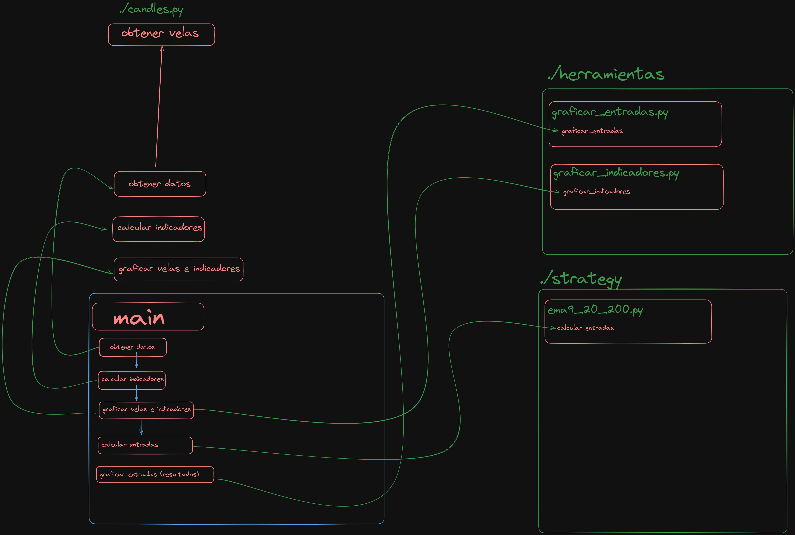

# ./Laboratorio 

# Financial Analysis Tool

This Python script is designed to perform financial analysis by calculating and visualizing various technical indicators and entry points for trading. It utilizes moving averages and the Relative Strength Index (RSI) to generate insights into financial data.

## Arquitecture

## Features

- **Data Retrieval**: Fetches financial data for analysis.
- **Indicator Calculation**: Calculates Exponential Moving Averages (EMA) for 9, 20, and 200 days, along with the RSI.
- **Visualization**: Plots the closing prices, EMAs, and RSI on a graph for visual analysis.
- **Entry Point Calculation**: Determines potential entry points, stop loss points, and profit points based on the calculated indicators.
- **Graphical Representation of Entry Points**: Visualizes the entry, stop loss, and profit points on the graph.

## How to Use

1. Ensure you have Python installed on your system.
2. Install the required libraries by running `pip install matplotlib pandas`.
3. Place the script in your desired directory.
4. Run the script using the command `python app.py`.
5. The script will generate and display the financial analysis graphs, along with saving a high-resolution version of the graph as a PNG file.

## Requirements

- Python 3.x
- matplotlib
- pandas
- binance-connector

## Function Descriptions

- `obtener_datos()`: Fetches the financial data for analysis.
- `calcular_indicadores(df)`: Calculates the EMAs and RSI based on the provided data frame.
- `graficar_indicadores(df_close, ema9, ema20, ema200)`: Plots the closing prices along with the calculated EMAs.
- `calcular_entradas(df_close, ema200, ema20, ema9)`: Determines the entry, stop loss, and profit points.
- `graficar_entradas(entry_points, stop_loss_points, profit_points)`: Visualizes the entry points on the graph.

## trades image

The images trades are like

## Note

This script is intended for educational and research purposes only. It should not be used as financial advice or for real trading without proper risk assessment and consultation with a financial expert.

